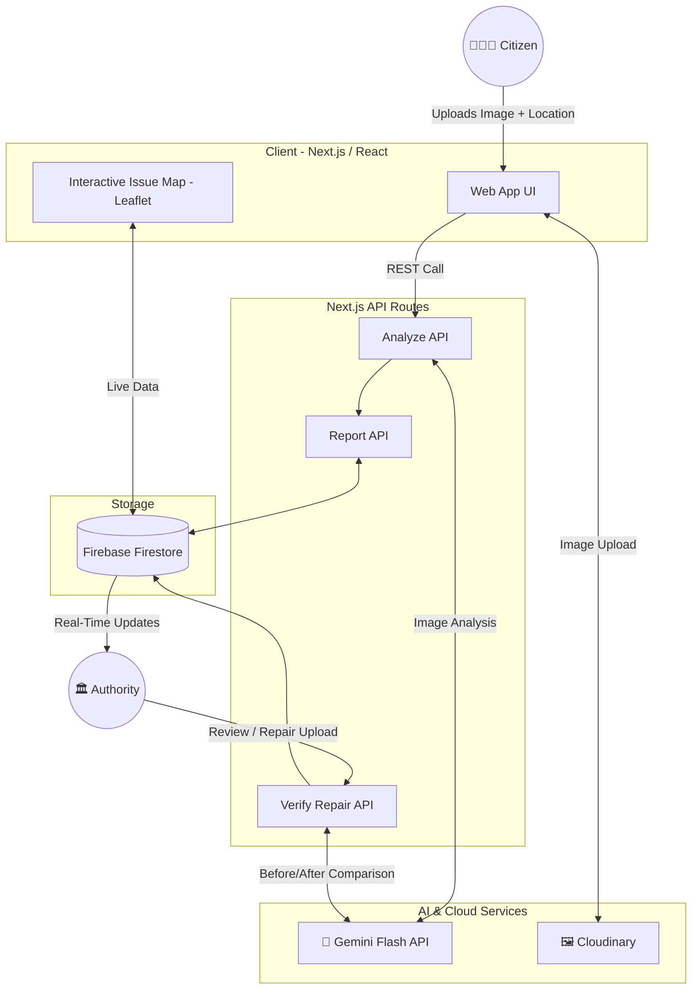
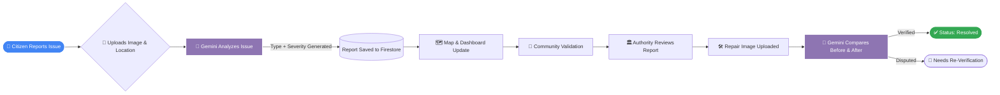

<div align="center">

# 🏆 Community Hero
### AI-Powered Hyperlocal Civic Issue Reporting & Resolution Platform


Built for the **Google Community Hero Hackathon**, organized by **Coding Ninjas**, leveraging **Google Gemini**, **Firebase**, and **Google Cloud** to build an AI-powered civic issue resolution platform.

[Live Demo](https://community-hero--community-hero-e0906.asia-southeast1.hosted.app)

</div>

---

## 📖 Table of Contents

- [Project Overview](#-project-overview)
- [Hackathon Requirements (Judges' Guide)](#-hackathon-requirements-judges-guide)
- [Key Features](#-key-features)
- [Google Technologies Utilized](#-google-technologies-utilized)
- [Tech Stack](#️-tech-stack)
- [System Architecture](#️-system-architecture)
- [Application Flow](#-application-flow)
- [Screenshots](#-screenshots)
- [Repository Structure](#-repository-structure)
- [Getting Started](#-getting-started)
- [Environment Variables](#-environment-variables)
- [Deployment](#-deployment)
- [Future Improvements](#-future-improvements)
- [Contributing](#-contributing)
- [Acknowledgements](#-acknowledgements)
- [Contact](#-contact)

---

## 🌍 Project Overview

### The Problem
Traditional civic reporting systems are broken: manual routing, subjective prioritization, bureaucratic bottlenecks, and "black-hole" feedback loops where citizens never hear back about their complaints. This leads to frustrated citizens, wasted municipal resources, and deteriorating infrastructure.

### The Community Hero Solution
**Community Hero** is an AI-powered civic issue management platform that enables citizens to report local infrastructure problems using images. Google Gemini automatically classifies issues, estimates severity, and assists authorities by verifying repair evidence through before-and-after image comparison — bringing transparency, speed, and intelligence to civic issue resolution.

---

## 🏆 Hackathon Requirements (Judges' Guide)

<details open>
<summary><b>Click to expand Hackathon Details</b></summary>

| Criteria | Implementation in Community Hero |
| :--- | :--- |
| **Problem Statement** | Community Hero – Hyperlocal Problem Solver. Empowers citizens to instantly report and track local civic issues while equipping authorities with an AI-assisted review and verification dashboard. |
| **Theme Alignment** | AI for Smart Cities. Integrates Gemini directly into the civic issue lifecycle — from detection to repair verification — to create transparent, self-organizing urban maintenance workflows. |
| **Solution Overview** | An end-to-end platform bridging citizens and authorities via AI-powered classification, severity estimation, duplicate detection, community validation, and repair verification. |
| **Impact & Community Benefits** | Reduces issue triage time from days to seconds. Promotes civic engagement through real-time tracking and community validation. Helps authorities detect fraudulent repair claims. |
| **Innovation & AI Capabilities** | Multimodal image-based issue detection, AI-driven severity scoring, smart duplicate merging within a 100m radius, and AI-powered before/after repair verification with re-verification workflows. |

</details>

---

## ✨ Key Features

### 🤖 AI & Automation
- **AI Issue Detection** — Google Gemini automatically detects civic issues from uploaded images, identifying type (Pothole, Garbage, Streetlight, Water Logging, Sewage) and estimating severity (Low, Medium, High, Severe).
- **AI Repair Verification** — Compares before-and-after images to verify completed repairs and flag potentially fraudulent submissions.
- **Re-Verification Workflow** — Disputed repairs can be resubmitted with new evidence for another round of AI verification.
- **Smart Duplicate Detection** — Automatically merges reports within a 100m radius to prevent duplicate complaints and spam.

### 🏙️ Civic & Authority Tools
- **Community Validation** — Citizens can confirm they're affected by an issue; higher validation increases its priority.
- **Interactive Issue Map** — Live emoji markers (🕳️🗑️💡💧🤢) with marker size scaling dynamically by affected citizen count.
- **Citizen Dashboard** — Nearby issues, live statistics, filtering & sorting, and an interactive map view.
- **Authority Dashboard** — Incident management, AI insights, fraud detection, and repair verification in one place.
- **Real-Time Synchronization** — Firestore `onSnapshot` keeps all devices updated instantly.

### 🎨 UI / UX
- **Responsive Design** — Consistent experience across mobile, tablet, and desktop.
- **Role-Based Access** — Separate, tailored experiences for Citizens and Authorities.

---

## ⚡ Google Technologies Utilized

| Technology | Purpose in Community Hero |
| :--- | :--- |
| **Gemini API** | The core brain — multimodal image analysis for issue detection, severity scoring, and before/after repair verification. |
| **Firebase Firestore** | Real-time NoSQL database powering live issue updates across citizen and authority dashboards. |
| **Firebase Authentication** | Secure, role-based authentication for citizens and authorities. |
| **Firebase App Hosting (Cloud Run)** | Serverless deployment of the Next.js application with automatic scaling. |
| **Google AI Studio** | Used to prototype and validate Gemini prompts and structured JSON output schemas before backend integration. |

---

## 🛠️ Tech Stack

### 🎨 Frontend
-  **Next.js 16 (App Router)**
-  **React**
-  **TypeScript**
-  **Tailwind CSS**

### ⚙️ Backend
- **Next.js API Routes** — Serverless functions for analysis, reporting, and verification endpoints.

### 🗄️ Database & Auth
-  **Firebase Firestore** — Real-time NoSQL database
- **Firebase Authentication** — Secure user auth

### 🤖 Artificial Intelligence
- **Google Gemini Flash** — Issue detection, severity scoring, repair verification

### 🖼️ Image Storage
-  **Cloudinary**

### 🗺️ Maps
- **Leaflet** & **OpenStreetMap**

### ☁️ Deployment
-  **Firebase App Hosting (Cloud Run)**

---

## 🏗️ System Architecture



---

## 🔄 Application Flow



---

## 📸 Screenshots

| Landing Page | Citizen Dashboard |
| :---: | :---: |
|  |  |
| **AI Issue Detection & Report Review** | **AI Repair Verification** |
|  |  |
| **Authority Dashboard** | |
|  | |

> *Gemini analyzes reported civic issues, classifies severity, and assists authorities during the review and repair-verification process.*

---

## 📂 Repository Structure

```text
community-hero/
├── src/
│   ├── app/
│   │   ├── api/
│   │   │   ├── analyze/
│   │   │   ├── report/
│   │   │   └── verify-repair/
│   │   ├── authority/
│   │   ├── dashboard/
│   │   ├── report/
│   │   ├── all-reports/
│   │   └── page.tsx
│   ├── components/
│   │   └── IssueMap.tsx
│   ├── lib/
│   │   ├── services/
│   │   ├── types/
│   │   └── utils/
│   └── providers/
├── public/
│   └── screenshots/
├── firebase.json
├── package.json
└── .env.local
```

---

## 🚀 Getting Started

### Prerequisites
- Node.js (v18 or later)
- npm or yarn
- Firebase Project
- Google AI Studio API Key
- Cloudinary Account

### 1. Clone the Repository
```bash
git clone https://github.com/Tanishq-Bansal-443/community-hero.git
cd community-hero
```

### 2. Install Dependencies
```bash
npm install
```

### 3. Configure Environment Variables
Create a `.env.local` file in the project root (see [Environment Variables](#-environment-variables) below).

### 4. Start Development Server
```bash
npm run dev
```

### 5. Open the Application
```text
http://localhost:3000
```

---

## 🔑 Environment Variables

```env
# Firebase
NEXT_PUBLIC_FIREBASE_API_KEY=your_api_key
NEXT_PUBLIC_FIREBASE_AUTH_DOMAIN=your_auth_domain
NEXT_PUBLIC_FIREBASE_PROJECT_ID=your_project_id
NEXT_PUBLIC_FIREBASE_STORAGE_BUCKET=your_storage_bucket
NEXT_PUBLIC_FIREBASE_MESSAGING_SENDER_ID=your_messaging_sender_id
NEXT_PUBLIC_FIREBASE_APP_ID=your_app_id

# Gemini AI
GEMINI_API_KEY=your_gemini_api_key

# Cloudinary
NEXT_PUBLIC_CLOUDINARY_CLOUD_NAME=your_cloud_name
NEXT_PUBLIC_CLOUDINARY_UPLOAD_PRESET=your_upload_preset
```

> [!IMPORTANT]
> You must add your own `GEMINI_API_KEY` in `.env.local` to use the AI capabilities of this project.

---

## 🌐 Deployment

The application is deployed using **Firebase App Hosting (Cloud Run)**.

### Build
```bash
npm run build
```

### Deploy
```bash
firebase deploy --only hosting
```

### Live Demo
**https://community-hero--community-hero-e0906.asia-southeast1.hosted.app**

---

## 🔮 Future Improvements

We have a broader vision for Community Hero. Post-hackathon, we plan to implement:
- **IoT Sensor Sync** — Connecting smart city sensors (water pressure, traffic) to automatically open tickets.
- **Predictive Maintenance Insights** — AI-driven forecasting of infrastructure degradation hotspots.
- **Satellite / Drone Monitoring** — Macro-level detection of infrastructure shifts and large-scale damage.
- **Emergency Alert Broadcasts** — Push notifications to citizens based on hyperlocal critical hazards.
- **Blockchain Verification** — Immutable ledgers for municipal budget allocation and repair completion proof.

---

## 🤝 Contributing

This project was developed for the **Google Community Hero Hackathon**, organized by **Coding Ninjas**.

Contributions, suggestions, and feedback are welcome — feel free to open an issue or submit a pull request.

---

## 🙏 Acknowledgements

- **Google** — For providing Gemini API, Google AI Studio, Firebase, and Firebase App Hosting.
- **Coding Ninjas** — For organizing and hosting the Community Hero Hackathon and providing an excellent platform to build impactful AI-powered solutions.
- **Cloudinary** — For image storage and delivery.
- **Leaflet & OpenStreetMap** — For enabling the interactive mapping experience.

---

## 📫 Contact

For any inquiries, feedback, or collaboration opportunities, feel free to open an issue on the [repository](https://github.com/Tanishq-Bansal-443/community-hero).

<div align="center">
<br>
<i>Crafted with ❤️ for the Google Community Hero Hackathon</i>
</div>