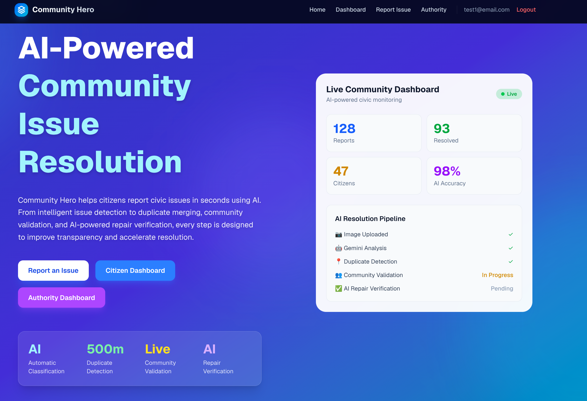
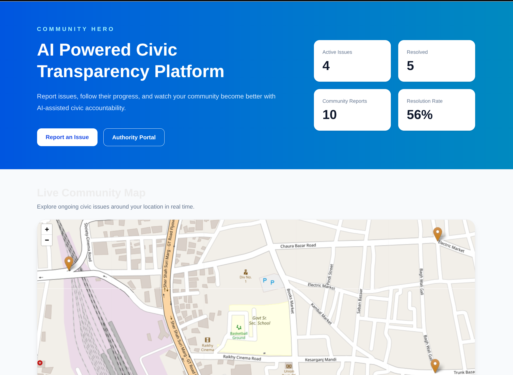
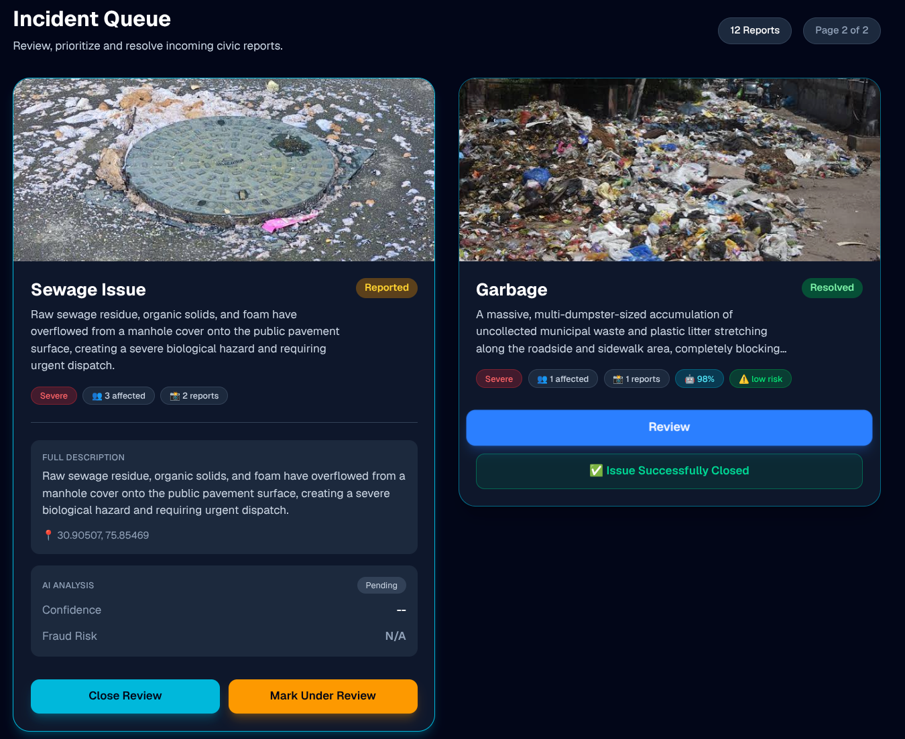
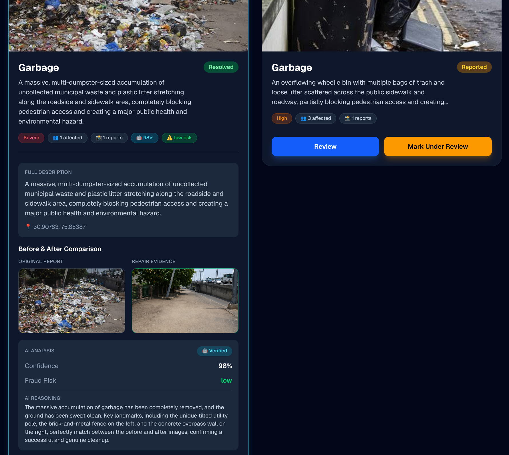
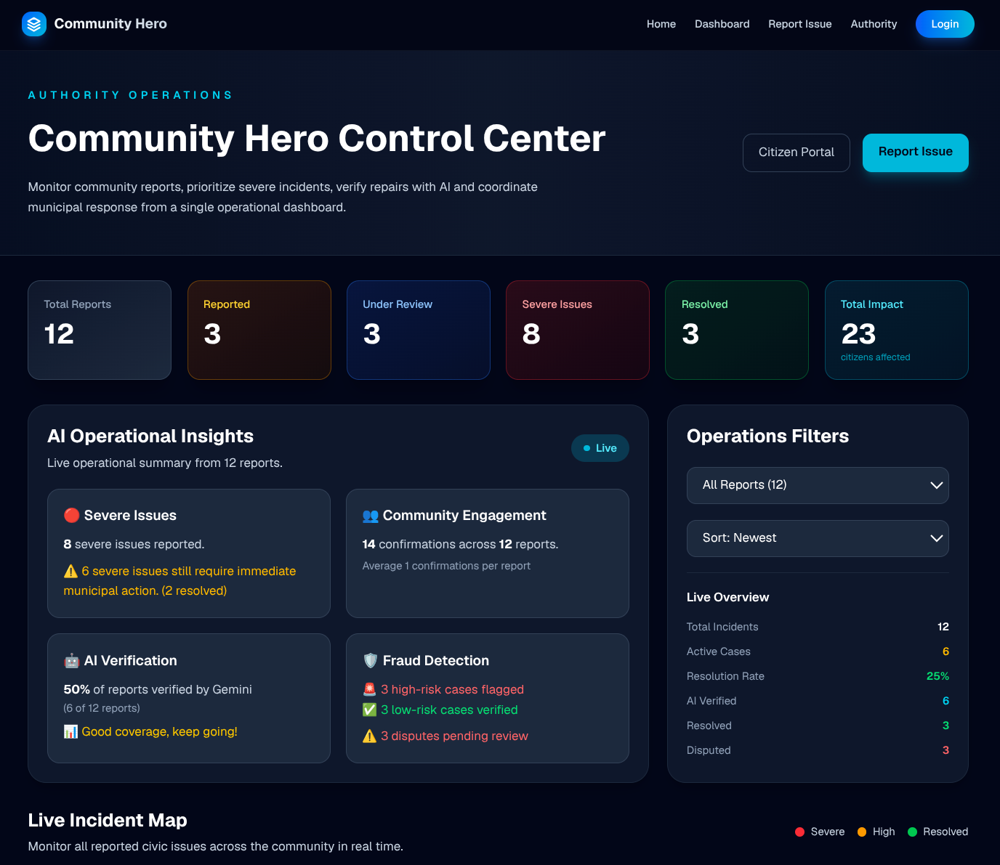

# 🏆 Community Hero – Hyperlocal Problem Solver

> 🏆 Built for the **Google Community Hero Hackathon**, organized by **Coding Ninjas**, leveraging **Google Gemini**, **Firebase**, and **Google Cloud** to build an AI-powered civic issue resolution platform.

**Community Hero** is an AI-powered civic issue management platform that enables citizens to report local infrastructure problems using images. Google Gemini automatically classifies issues, estimates severity, and assists authorities by verifying repair evidence through before-and-after image comparison.

## 🚀 Live Demo

**https://community-hero--community-hero-e0906.asia-southeast1.hosted.app**

---

# 📋 Table of Contents

- [✨ Features](#-features)
- [🛠️ Tech Stack](#️-tech-stack)
- [🏗️ Architecture](#️-architecture)
- [🚀 Getting Started](#-getting-started)
- [🔑 Environment Variables](#-environment-variables)
- [📸 Screenshots](#-screenshots)
- [📂 Repository Structure](#-repository-structure)
- [🚀 Deployment](#-deployment)
- [🤝 Contributing](#-contributing)
- [🙏 Acknowledgements](#-acknowledgements)

---

# ✨ Features

- 🤖 **AI Issue Detection**
  - Google Gemini automatically detects civic issues from uploaded images.
  - Identifies issue type (Pothole, Garbage, Streetlight, Water Logging, Sewage).
  - Estimates severity (Low, Medium, High, Severe).

---

- ✅ **AI Repair Verification**
  - Compares before-and-after images.
  - Verifies completed repairs.
  - Detects potential fraudulent repair submissions.

---

- 🔄 **Re-Verification Workflow**
  - Disputed repairs can be resubmitted.
  - AI performs another verification using new evidence.

---

- 🎯 **Smart Duplicate Detection**
  - Automatically merges reports within a **100 m radius**.
  - Prevents duplicate complaints and spam.

---

- 👥 **Community Validation**
  - Citizens can confirm they are affected.
  - Higher validation increases issue priority.

---

- 🗺️ **Interactive Issue Map**
  - Live emoji markers (🕳️🗑️💡💧🤢).
  - Marker size scales dynamically with affected citizen count.

---

- 📊 **Citizen Dashboard**
  - Nearby issues
  - Live statistics
  - Filtering & sorting
  - Interactive map

---

- 🏛️ **Authority Dashboard**
  - Incident management
  - AI insights
  - Fraud detection
  - Repair verification

---

- ⚡ **Real-Time Synchronization**
  - Firestore `onSnapshot` keeps all devices updated instantly.

---

# 🛠️ Tech Stack

### 🎨 Frontend
- Next.js 16 (App Router)
- React
- TypeScript
- Tailwind CSS

### ⚙️ Backend
- Next.js API Routes
- Serverless Functions

### 🗄️ Database
- Firebase Firestore (Real-Time NoSQL)

### 🔐 Authentication
- Firebase Authentication

### 🤖 Artificial Intelligence
- Google Gemini Flash

### 🖼️ Image Storage
- Cloudinary

### 🗺️ Maps
- Leaflet
- OpenStreetMap

### ☁️ Deployment
- Firebase App Hosting (Cloud Run)

---

# 🏗️ Architecture

## 🏗️ System Architecture

```text
                    Community Hero

      ┌──────────────────────────────────┐
      │         Next.js Frontend         │
      │                                  │
      │ • Landing Page                   │
      │ • Citizen Dashboard              │
      │ • Authority Dashboard            │
      │ • Report Form                    │
      │ • Interactive Map                │
      └──────────────┬───────────────────┘
                     │
             Next.js API Routes
                     │
     ┌───────────────┼────────────────┐
     │               │                │
     ▼               ▼                ▼
 Gemini API     Firebase        Cloudinary
                Firestore
                    │
                    ▼
             Real-Time Updates
```

## Data Flow

```text
Citizen uploads image
        │
        ▼
Frontend calls /analyze
        │
        ▼
Gemini analyzes image
        │
        ▼
Issue Type + Severity Generated
        │
        ▼
Report Saved to Firestore
        │
        ▼
Interactive Map Updates
        │
        ▼
Community Validation
        │
        ▼
Authority Reviews Report
        │
        ▼
Repair Image Uploaded
        │
        ▼
Gemini Compares Before & After Images
        │
        ▼
Status Updated
        ├──► Resolved
        └──► Rejected / Needs Re-Verification
```

---

# 🚀 Getting Started

## Prerequisites

- Node.js (v18 or later)
- npm or yarn
- Firebase Project
- Google AI Studio API Key
- Cloudinary Account

## Installation

### 1. Clone the Repository

```bash
git clone https://github.com/Tanishq-Bansal-443/community-hero.git
cd community-hero
```

### 2. Install Dependencies

```bash
npm install
```

### 3. Configure Environment Variables

Create a `.env.local` file in the project root.

### 4. Start Development Server

```bash
npm run dev
```

### 5. Open the Application

```text
http://localhost:3000
```

---

# 🔑 Environment Variables

```env
# Firebase
NEXT_PUBLIC_FIREBASE_API_KEY=your_api_key
NEXT_PUBLIC_FIREBASE_AUTH_DOMAIN=your_auth_domain
NEXT_PUBLIC_FIREBASE_PROJECT_ID=your_project_id
NEXT_PUBLIC_FIREBASE_STORAGE_BUCKET=your_storage_bucket
NEXT_PUBLIC_FIREBASE_MESSAGING_SENDER_ID=your_messaging_sender_id
NEXT_PUBLIC_FIREBASE_APP_ID=your_app_id

# Gemini AI
GEMINI_API_KEY=your_gemini_api_key

# Cloudinary
NEXT_PUBLIC_CLOUDINARY_CLOUD_NAME=your_cloud_name
NEXT_PUBLIC_CLOUDINARY_UPLOAD_PRESET=your_upload_preset
```

---

# 📸 Screenshots

## Landing Page



---

## Citizen Dashboard



---

## AI Issue Detection & Report Review

> *Gemini analyzes reported civic issues, classifies severity, and assists authorities during the review process.*



---

## AI Repair Verification



---

## Authority Dashboard



---

# 📂 Repository Structure

```text
community-hero/
├── src/
│   ├── app/
│   │   ├── api/
│   │   │   ├── analyze/
│   │   │   ├── report/
│   │   │   └── verify-repair/
│   │   ├── authority/
│   │   ├── dashboard/
│   │   ├── report/
│   │   ├── all-reports/
│   │   └── page.tsx
│   ├── components/
│   │   └── IssueMap.tsx
│   ├── lib/
│   │   ├── services/
│   │   ├── types/
│   │   └── utils/
│   └── providers/
├── public/
├── firebase.json
├── package.json
└── .env.local
```

---

# 🚀 Deployment

The application is deployed using **Firebase App Hosting (Cloud Run).**

## Build

```bash
npm run build
```

## Deploy

```bash
firebase deploy --only hosting
```

## Live Demo

**https://community-hero--community-hero-e0906.asia-southeast1.hosted.app**

---

# 🤝 Contributing

This project was developed for the **Google Community Hero Hackathon**.

Contributions, suggestions, and feedback are welcome.

---

# 🙏 Acknowledgements

- **Google** — For providing Gemini API, Google AI Studio, Firebase, and Firebase App Hosting.
- **Coding Ninjas** — For organizing and hosting the Community Hero Hackathon and providing an excellent platform to build impactful AI-powered solutions.
- **Cloudinary** — For image storage and delivery.
- **Leaflet & OpenStreetMap** — For enabling the interactive mapping experience.
